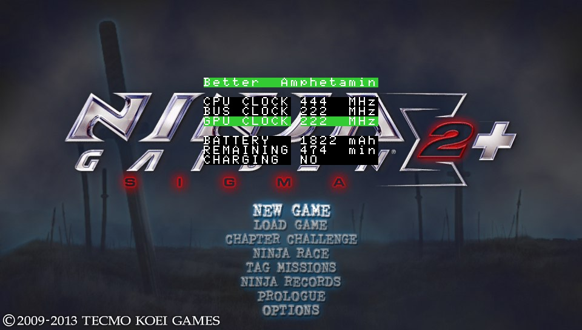

> Original code for @TheFloW, thanks for @Rinnegatamante & @BeatPlay & @DreamPiggy  
> This plugin is for overclock, you can set CPU/BUS/GPU to MAX 444/222/222MHz(and more for advanced setting)

# Function
+ Overclocking (duh)
+ emaining battery (in mAh)
+ Estimated SoT
+ Estimated time to fully charge the battery
+ Eslimated battery temperature
+ Game Title ID

# Usage
Create a folder called `plugins` in `ux0:/` . Then put `amphetamin.suprx` and `game.txt` into `ux0:/plugins/`.

Press SELECT button for 2 seconds after launching game from Vitamin or MaiDumpTool, you will see the plugin menu. Use up and down to navigate, left and right to change speed for CPU/BUS/GPU frequency.

You can download both `amphetamin.suprx` and `game.txt` from release page.

# Config
For advanced setting, create a file named `config.txt` and put it into `ux0:/data/amphetamin`. You should use common editor but not Windows default notepad.exe(You can use wordpad.exe, Notepad++, EditPlus, Sublime Text, Atom or more, Which use `\n` for linebreak).
The file content must be:

```ini
freq_accurate=0
show_advanced=0
```

`freq_accurate`: 1 to enable accurate frequence(5MHz per select)  
`show_advanced`: 1 to enable advaned setting(currently has XBAR clock setting)

You can also download that `config.txt` from release page. You can also transfer it to PSV and use VitaShell to edit it.

# Changelog
+ v3.2
	+ add GPU XBAR(Crossbar) frequency(need advanced setting)
	+ add config for advanced setting and accurate frequency
	+ add battery temperature
	+ add game TITLE_ID
+ v3.1.1:  
	+ long press button time change to 2s  
	+ align the text layout  
+ v3.1:  
	+ fixed clockrate not changing  
	+ removed faulty FPS counter  
	+ allowing 222mhz GPU  
+ v3:  
	+ made overclocking more precise  
	+ deactivated inital auto overclock  
+ v2:  
	+ minor bug fixes for various games  
+ v1:  
	+ initial release  

# ScreenShot
